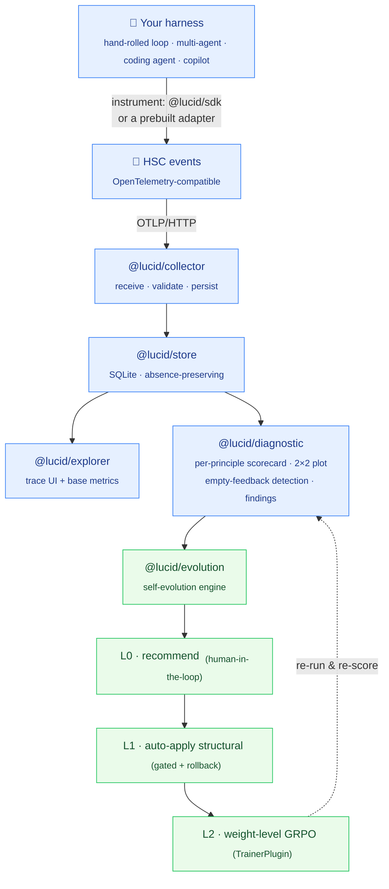
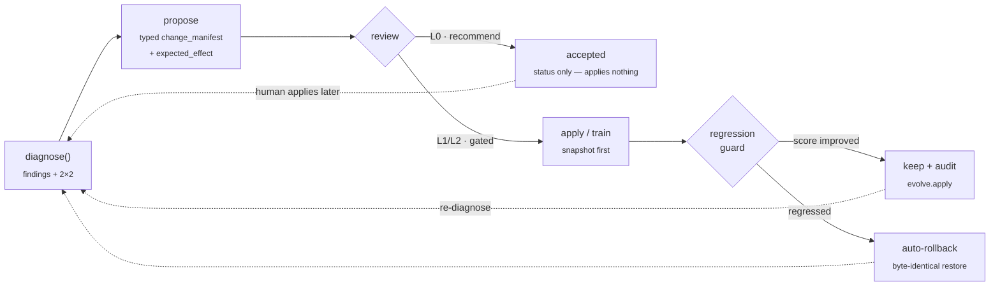
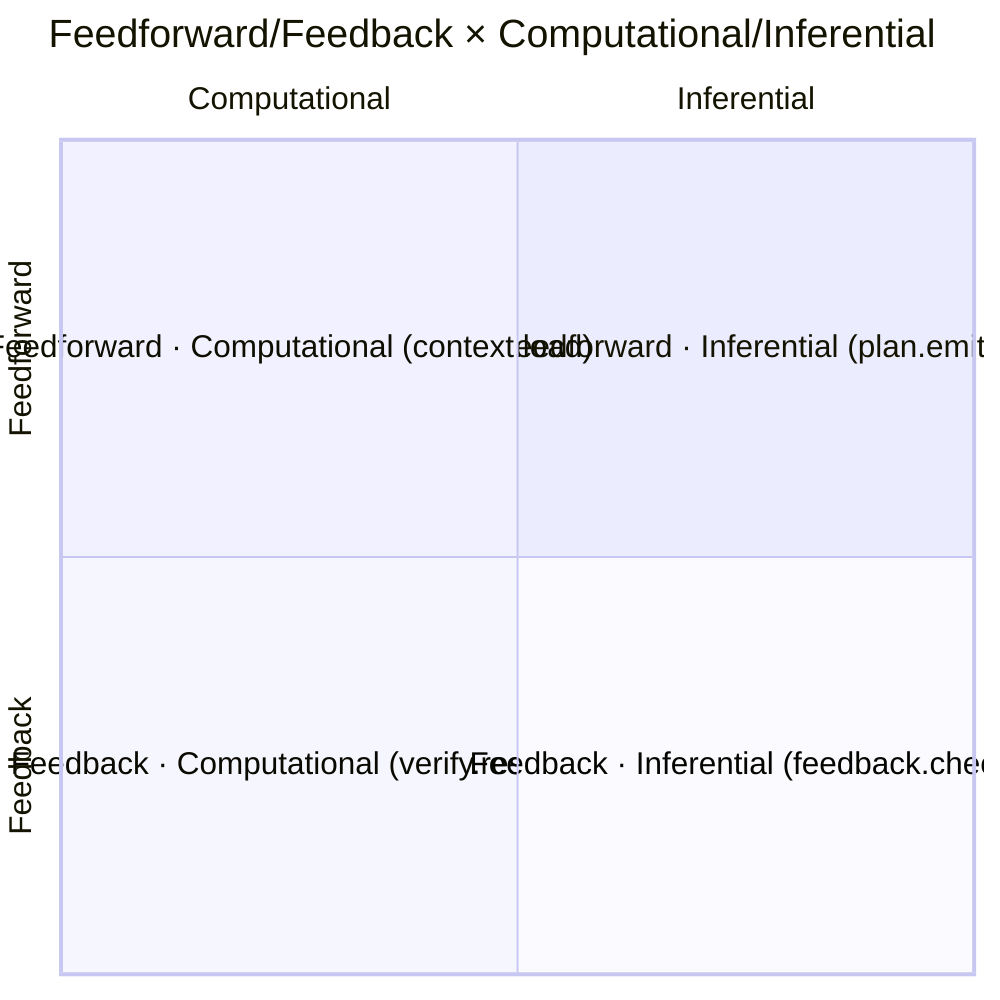

# Lucid-AI

[](https://github.com/ronny2497/Lucid-AI/actions/workflows/ci.yml)
[](./LICENSE)
[](#project-status)

**An open, framework-neutral observability + evaluation plane for agent harnesses — with a configurable self-evolution engine on top.**

> Stop asking whether the agent *worked*. Ask what the harness *observed*.

---

## What it is

Lucid-AI is a **base layer**, not an application. Any agent harness — a hand-rolled loop, a multi-agent system, a coding agent, an enterprise assistant — emits a standard event stream (the **Harness Semantic Conventions (HSC)**, an OpenTelemetry-compatible profile). Lucid-AI ingests that stream and scores each run on two layers: **standard agent metrics** (success, cost, latency, tokens, tool-error rate) and a **discipline-native diagnostic** that scores the harness against the **Five Convergence Principles** and plots it on the **feedforward/feedback × computational/inferential 2×2**. It surfaces structural gaps — the most important being the *absence* of feedback. Then a **Self-Evolution Engine** closes the loop: it turns those diagnoses into change proposals and, at a **configurable autonomy level**, recommends or applies harness improvements — from prompt/skill/config edits up to weight-level GRPO — human-governed by default.

Your application (a sales assistant, a coding agent, a copilot) is the **top layer**, built *on* a harness. Lucid-AI observes and improves the harness underneath. It is not the application, and it is not tied to any framework. Packages ship under the `@lucid/` npm scope.

## Who it's for

- **Agent / harness builders** — instrument your harness once (SDK or a prebuilt adapter), get a principled scorecard of *what your scaffold actually does*, and a falsifiable path to improve it.
- **Platform / infra teams** running many agents — a neutral, OSS, self-hostable trace plane + base metrics across every framework, with a compliance-export path (EU AI Act / Colorado).
- **Self-improving-systems researchers** — a reproducible substrate for the recommend → auto-apply → train autonomy ladder, with reward signals grounded in the principle/2×2 diagnostic.

## How it works



Every layer is opt-in and additive. **Diagnosis is read-only.** Self-evolution is **human-governed by default** and escalates only as far as you configure — and the loop closes: each applied change is re-scored against the same diagnostic.

### The self-evolution loop

Diagnoses become **falsifiable** change proposals: each carries a predicted principle-score delta, and a regression guard checks the real delta after the change — keeping it or rolling back automatically.



### The diagnostic lens — the convergence 2×2

Every HSC event is tagged by **principle** and placed on the 2×2. The differentiator is reading the *columns*: a harness that never emits `verify.result` after a state-mutating tool call has an **empty feedback column** — Lucid-AI detects that absence automatically and names it as the headline finding.



## Quickstart

Prereqs: **Node ≥ 20**, **pnpm ≥ 9**. (Python ≥ 3.10 only if you run the optional L2 GRPO trainer sidecar.)

```bash
git clone https://github.com/ronny2497/Lucid-AI.git
cd Lucid-AI
pnpm install
pnpm -r build
```

> **macOS native-build note:** `@lucid/store` uses `better-sqlite3`. If its native build can't find `<climits>`, export the SDK path first —
> `export SDKROOT="$(xcrun --show-sdk-path)" CPLUS_INCLUDE_PATH="$SDKROOT/usr/include/c++/v1:$SDKROOT/usr/include"` — then re-run the build.

**1 — Run the collector** (OTLP/JSON receiver + read API, port 4318):

```bash
node packages/collector/dist/server.js     # override with LUCID_COLLECTOR_PORT / LUCID_STORE_PATH
```

**2 — Send a trace** (use the bundled example, or instrument your harness — see the getting-started guide):

```bash
curl -X POST http://localhost:4318/v1/traces \
  -H 'content-type: application/json' \
  --data @examples/hermes-trace.json
curl http://localhost:4318/api/traces      # the run is now queryable
curl http://localhost:4318/api/metrics     # success / cost / latency / tokens / tool-error
```

**3 — Open the explorer** (run list + trace timeline + metrics panel):

```bash
pnpm --filter @lucid/explorer dev          # then open the printed localhost URL
```

**4 — Validate against the standard** (three-layer conformance suite):

```bash
node packages/conformance/dist/cli.js --trace examples/hermes-trace.json   # exit 0 = conforms to HSC v0
```

**5 — Diagnose & propose** (the differentiator + the self-evolution loop):

```bash
node packages/collector/dist/cli.js evolve --help
node packages/collector/dist/cli.js evolve propose --finding F1 --from <diagnostic.json>
```

> The CLIs run from the built `dist/` above. Once published under `@lucid/`, the same commands are the friendly `lucid …` / `lucid-conformance …` / `lucid-compliance …` binaries (the `lucid` bin is provided by `@lucid/collector`).

## Why it's different

Existing tools (LangSmith, Langfuse, raw OpenTelemetry) observe **LLM calls and chains**. Lucid-AI's unit of analysis is the **harness** — the engineered scaffold around the model — and it scores that harness against a **discipline** (the convergence principles), not just generic metrics. And it doesn't stop at diagnosis: it feeds a **self-evolution loop**. No other tool combines (a) an open harness-level standard, (b) a principle-based diagnostic, and (c) a configurable self-improvement engine.

## Package map

| Package | What it does |
|---------|--------------|
| `@lucid/hsc-schema` | HSC v0 JSON Schema (2020-12) + event-type/attribute constants + `quadrantFor()` predicate |
| `@lucid/conformance` | `validateTrace()` + the three-layer conformance suite + `lucid-conformance` CLI / badge |
| `@lucid/sdk` | OTel wrapper that emits HSC events (`harness.event` / `start().end()`) + OTLP/HTTP exporter |
| `@lucid/store` | `TraceStore` interface + `SqliteTraceStore` (absence-preserving) |
| `@lucid/hsc-map` | Isolates provisional `gen_ai.*` names, model pricing, and success-source policy |
| `@lucid/collector` | Hono OTLP/JSON receiver, `/api/traces`·`/api/metrics`, and the unified `lucid` CLI |
| `@lucid/diagnostic` | Detectors + coverage scorer + 2×2 plotter + findings + `diagnose()` + version diffing |
| `@lucid/evolution` | `change_manifest` + `propose()` + L0/L1/L2 self-evolution + the `evolve` CLI |
| `@lucid/adapter-sdk` | `defineAdapter()` + emit-or-omit + `adapter init` scaffolder |
| `@lucid/adapter-hermes` · `@lucid/adapter-langgraph` · `@lucid/adapter-openai-agents` | Reference + neutral framework adapters |
| `@lucid/compliance` | Hash-chained audit log + EU AI Act / Colorado evidence export (`lucid-compliance`) |
| `@lucid/explorer` | Read-only trace explorer (Vite + React) |
| `packages/trainer-grpo` *(Python, optional)* | Reference TRL GRPO sidecar behind the `TrainerPlugin` boundary (L2) |

## The standard (HSC)

The **Harness Semantic Conventions** are an OpenTelemetry-compatible profile: the agentic core (LLM calls, tools, agent invocations) maps onto OTel GenAI conventions; a clean `harness.*` namespace owns what OTel lacks (principle, quadrant, evolve events). Every event is principle- and quadrant-tagged, and **absence is signal** — a missing `verify.result` after a state-mutating tool call is recorded honestly, never fabricated. See [`docs/standard/`](./docs/standard/) (`hsc-v0-spec.md`, `attribute-registry.md`, `otel-mapping.md`, `transport-profile.md`).

## Project status

**v1.0 shipped.** All seven build phases are complete and verified — the HSC standard, the observability plane (ingestion / store / explorer / base metrics), the principle/2×2 diagnostic, the full autonomy ladder (L0 → L1 → L2), and OSS hardening (conformance suite, adapter SDK, compliance export). 600+ TypeScript tests and 9 Python tests pass; the workspace builds clean.

Honest carve-outs (verified at the contract/CI layer; these require a human or hardware to exercise live):
- The **real GPU GRPO run + held-out eval** (L2) is manual — CI proves the TrainerPlugin boundary and the promotion gate via a pure-TS `MockTrainerPlugin`.
- The bundled hermes trace is a **recorded capture**; a live harness run reproduces it once the harness is wired in.
- The **regulatory mappings** (EU AI Act Article 12; Colorado SB 26-189, marked `[PENDING AG RULEMAKING]`) ship as evidence-assembly tooling, **not legal certification** — have counsel review before relying on them.

## Documentation

- **Start here:** [`docs/guides/getting-started.md`](./docs/guides/getting-started.md)
- **Concepts:** [`docs/00-vision.md`](./docs/00-vision.md) · [`docs/01-concepts.md`](./docs/01-concepts.md) · [`docs/02-architecture.md`](./docs/02-architecture.md)
- **The standard:** [`docs/standard/`](./docs/standard/)
- **Guides:** [`docs/guides/`](./docs/guides/) — instrumenting a harness, reading diagnostics, authoring an adapter, configuring self-evolution, the conformance badge, compliance export, and self-hosting the trainer sidecar.

## Contributing

Adapters, detectors, and conformance fixtures especially welcome. See [`CONTRIBUTING.md`](./CONTRIBUTING.md) and [`CODE_OF_CONDUCT.md`](./CODE_OF_CONDUCT.md).

## License

[Apache-2.0](./LICENSE). The standard, SDK, and adapters are permissively licensed — adoption of HSC is the goal.
