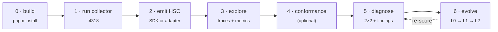

# Getting Started

This guide takes you from a fresh clone to your **first diagnosed run** end-to-end. Lucid-AI v1.0 is shipped; every command below runs against the built workspace.



## Prerequisites
- **Node ≥ 20** and **pnpm ≥ 9**.
- An existing agent/harness to instrument (any framework, any model) — you do **not** rewrite it. To just try the pipeline, use the bundled `examples/hermes-trace.json`.
- **Python ≥ 3.10** only if you later opt into the L2 weight-training sidecar.

## Step 0 — Clone & build
```bash
git clone https://github.com/ronny2497/Lucid-AI.git
cd Lucid-AI
pnpm install
pnpm -r build
```

> **macOS native-build caveat:** `@lucid/store` compiles `better-sqlite3`. If the build fails with `'climits' file not found`, export the SDK include path and rebuild:
> ```bash
> export SDKROOT="$(xcrun --show-sdk-path)"
> export CPLUS_INCLUDE_PATH="$SDKROOT/usr/include/c++/v1:$SDKROOT/usr/include"
> pnpm -r build
> ```

## Step 1 — Run the collector
The collector receives OTLP/JSON traces, validates them against HSC, and persists valid spans to a SQLite store. It also serves the read API.
```bash
node packages/collector/dist/server.js
# listens on :4318  (override: LUCID_COLLECTOR_PORT=… LUCID_STORE_PATH=./lucid-traces.db)
```

## Step 2 — Emit HSC events (pick the lowest-effort path)

**A) Try it instantly with the bundled example trace:**
```bash
curl -X POST http://localhost:4318/v1/traces \
  -H 'content-type: application/json' \
  --data @examples/hermes-trace.json
```

**B) Supported framework → use a prebuilt adapter:**
```ts
// @lucid/adapter-langgraph (neutral) or @lucid/adapter-openai-agents or @lucid/adapter-hermes
import { defineAdapter } from "@lucid/adapter-sdk";
// each adapter maps its framework's spans → HSC events and ships them via @lucid/sdk's OTLP exporter
```

**C) Unsupported framework → wrap your loop with the SDK (incremental effort):**
```ts
import { harness, initTracing } from "@lucid/sdk";

initTracing({ endpoint: "http://localhost:4318" });   // OTLP/HTTP → the collector

harness.event("context.load", { principle: "context", genAi: { inputTokens: 1840 } });
harness.event("plan.emit",    { principle: "plan_execute" });
harness.event("tool.call",    { principle: "plan_execute", mutatedState: true });
// (no verify.result here → Lucid flags the missing feedback — absence is signal)
```
Partial instrumentation still produces partial value: start with `tool.call`s and add events over time. The SDK never fabricates a missing event, and never sets content-bearing fields (prompts, tool args) unless you opt in.

## Step 3 — See your traces and base metrics
```bash
curl http://localhost:4318/api/traces       # run list
curl http://localhost:4318/api/metrics       # success · cost · latency p50/p95 · tokens · tool-error
```
Or open the **explorer UI** (run list, single-trace timeline with per-event type/principle/quadrant, metrics panel):
```bash
pnpm --filter @lucid/explorer dev            # open the printed localhost URL
```

## Step 4 — Validate against the standard (optional)
```bash
node packages/conformance/dist/cli.js --trace examples/hermes-trace.json
# exit 0 = conforms to HSC v0; --adapter <dir> validates a corpus; --emit-badge writes a report + badge
```

## Step 5 — Get your first diagnosis
`@lucid/diagnostic`'s `diagnose(trace)` produces the scorecard + 2×2 + findings:
```ts
import { diagnose } from "@lucid/diagnostic";
const result = diagnose(trace);   // trace from @lucid/store getTrace / your captured HSC trace
```
A diagnosis looks like:
```
Context        0.81
Plan+Execute   0.74
Feedback       null   ⚠ coverage 0 — state-mutating tool calls had no verify.result
One-at-a-time  0.66
Codebase=Docs  0.90
2×2: feedback column EMPTY. Finding F1 (feedback.no-verify-after-mutation):
     add a verify.result event after db.write calls in the same turn.
```
**How to read it:** a per-principle score (`null` + `coverage:0` means *not instrumented*, never a fake `0` or `1`), the feedforward/feedback × computational/inferential plot, and **named, actionable findings** — the headline being an *empty feedback column*. See [Reading Diagnostics](reading-diagnostics.md).

## Step 6 — The self-evolution loop (L0 → L1 → L2)
Self-evolution turns a finding into a typed, falsifiable `change_manifest`. It is **human-governed by default** and escalates only as far as you configure ([Configuring Self-Evolution](configuring-self-evolution.md)).
```bash
# L0 — recommend (HITL): propose a change for a finding, review it, accept (status only — applies nothing)
node packages/collector/dist/cli.js evolve propose --finding F1 --from <diagnostic.json>
node packages/collector/dist/cli.js evolve review <manifest-id>
node packages/collector/dist/cli.js evolve list

# L1 — auto-apply structural changes behind a gate, with snapshot + automatic rollback on regression
node packages/collector/dist/cli.js evolve apply <manifest-id>
node packages/collector/dist/cli.js evolve rollback <id>
node packages/collector/dist/cli.js evolve audit

# L2 — weight-level GRPO (optional, gated). The TS core never imports Python; training runs in the
# packages/trainer-grpo sidecar behind the TrainerPlugin boundary. CI uses a pure-TS MockTrainerPlugin;
# the real GPU run is operator-driven — see Self-Hosting the Trainer Sidecar.
node packages/collector/dist/cli.js evolve train --help
```

## What's next
- [Instrumenting Your Harness](instrumenting-your-harness.md) — deeper SDK + adapter coverage.
- [Reading Diagnostics](reading-diagnostics.md) — the principles, the 2×2, and what each finding means.
- [Authoring an Adapter](adapter-authoring.md) — `defineAdapter` + `adapter init` + the conformance badge.
- [Configuring Self-Evolution](configuring-self-evolution.md) — the autonomy ladder and its gates.
- [Self-Hosting the Trainer Sidecar](self-hosting-trainer-sidecar.md) — the optional L2 GRPO setup.
- [Compliance Export](compliance-export.md) — assembling EU AI Act / Colorado evidence packages.
